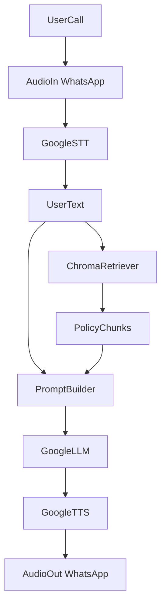

<!-- a3cb1acd-97dc-49de-9d9e-5334e0165bca 91c35141-2655-4225-9ac6-434396611a6b -->
# WhatsApp Voice Agent RAG Integration Plan

### 1. RAG architecture and data flow

- **Goal**: Let the voice agent answer HR questions strictly from `HR-Policies-Manuals.pdf` using RAG, while keeping the existing Google LLM-based voice pipeline.
- **High-level flow**:
  - User speaks on WhatsApp → audio → STT → text query
  - Query → vector search over Chroma (built from the HR PDF)
  - Top‑k policy chunks → injected into the LLM prompt
  - Google LLM generates a short answer constrained to the provided chunks
  - Answer → TTS → audio back to WhatsApp.

### 2. Dependencies and configuration

- **Add dependencies** (in `pyproject.toml`):
  - `chromadb` for local vector DB.
  - `openai` (or `openai>=1.x`) for embeddings.
  - `pypdf` (or `pymupdf`) for PDF text extraction.
- **Environment variables**:
  - `OPENAI_API_KEY` (already used or add now for embeddings).
  - `RAG_DB_PATH` (e.g. `.rag/hr_policies_chroma`) for Chroma persistence.
- **Directory structure**:
  - Create a small `rag/` or `rag_scripts/` module under `whatsapp/` for indexing and retrieval helpers.

### 3. One‑time PDF indexing script

- **New script**: `whatsapp/rag_index_hr_policies.py`.
- **Responsibilities**:
  - Load `/home/harsh-patel/Desktop/projects/pipecat-examples/whatsapp/HR-Policies-Manuals.pdf`.
  - Extract text per page, clean it (strip headers/footers if simple), and split into overlapping chunks (e.g. 800–1000 chars with 200 overlap).
  - Attach simple metadata per chunk: page number, section heading (if detectable), filename.
  - Use OpenAI embeddings API to embed each chunk.
  - Store in a Chroma collection (e.g. `"hr_policies"`) in the `RAG_DB_PATH` directory.
- **CLI**:
  - Run once: `python rag_index_hr_policies.py`.
  - Safe to rerun with `recreate`/`upsert` behavior.

### 4. RAG helper module for querying

- **New module**: `whatsapp/rag_hr_policies.py`.
- **Responsibilities**:
  - Initialize Chroma client pointing to `RAG_DB_PATH` and collection `"hr_policies"`.
  - Provide `async def retrieve_hr_context(query: str, k: int = 5) -> list[str]`:
    - Use OpenAI embeddings on the `query`.
    - Query Chroma for top‑k similar chunks.
    - Return a list of text snippets (and optionally their metadata) for prompt building.
  - Optionally cache the Chroma client/collection at module level so `run_bot` calls are cheap.

### 5. Wire RAG into the voice pipeline (bot.py)

- **Where**: In `bot.py` inside `run_bot`, between STT output and call to `GoogleLLMService`.
- **Changes**:
  - After STT produces user text (which is already fed into `LLMContextAggregatorPair`):
    - Wrap the LLM call behind a small helper that:
      - Extracts the latest user message from `context`.
      - Calls `retrieve_hr_context(latest_user_text)`.
      - Builds a RAG prompt such as:
        - System: "You are an HR policies assistant. Answer *only* from the provided company policy context. If not covered, say you don’t know or it’s not in the policy."
        - Context block: concatenated top‑k chunks with page references.
        - User: original query.
      - Sends this augmented prompt into `GoogleLLMService` via its existing context/universal interface.
  - Keep responses **short** (1–3 sentences) to fit your current voice UX.
- **Prompt format** (conceptual):
  - System: HR‑specific instruction.
  - Context: `"CONTEXT:\n[chunk 1]\n---\n[chunk 2]..."`.
  - User: original question.

### 6. Strict PDF‑only answering behavior

- **Enforce constraint in prompt**:
  - Explicitly instruct: "If the answer is not clearly supported by the context, say: 'I couldn’t find that in the HR policies document.'"
- **Optional guardrail**:
  - After LLM reply, optionally run a cheap check:
    - If no chunks were returned (no matches), override the answer with a fixed message about missing policy information.

### 7. Testing and tuning

- **Local tests**:
  - Call the RAG retriever directly (via a small `if __name__ == "__main__"` in `rag_hr_policies.py`) to test queries like:
    - "What is the maternity leave policy?"
    - "What is the notice period for resignation?"
- **End‑to‑end voice tests**:
  - With `python server.py` running, ask HR questions on WhatsApp and:
    - Confirm debug logs show RAG retrieval hits (log selected chunk titles/pages).
    - Confirm the context logging you already added shows the HR snippets in the messages before the LLM answer.
- **Tuning knobs**:
  - Chunk size/overlap.
  - Top‑k value for retrieval (e.g. 3–8).
  - Temperature for GoogleLLMService (if exposed) to keep answers precise.

### 8. Files to touch / create

- **Update**:
  - `whatsapp/pyproject.toml` – add Chroma, OpenAI, and PDF parser deps.
  - `whatsapp/bot.py` – integrate RAG prompt building around the existing pipeline.
- **New**:
  - `whatsapp/rag_index_hr_policies.py` – one‑time/maintenance indexer.
  - `whatsapp/rag_hr_policies.py` – reusable retrieval helper for the agent.

### To-dos

- [ ] Add OpenAI, FAISS, and PDF parsing dependencies; create a build_hr_index.py script to chunk and embed HR-Policies-Manuals.pdf into a FAISS index with chunk metadata.
- [ ] Create an hr_rag.py module with HRPolicyRetriever that loads the FAISS index and exposes a retrieve(query, k) API with good logging.
- [ ] Tighten SYSTEM_INSTRUCTION and implement a helper to build strict HR-only prompts that include retrieved policy context plus the latest user question.
- [ ] Integrate RAG into bot.py pipeline so each finalized user utterance triggers retrieval and injects HR policy context before GoogleLLMService runs.
- [ ] Enhance logging to show RAG queries and retrieved chunks, and test both via a CLI script and end-to-end WhatsApp calls.